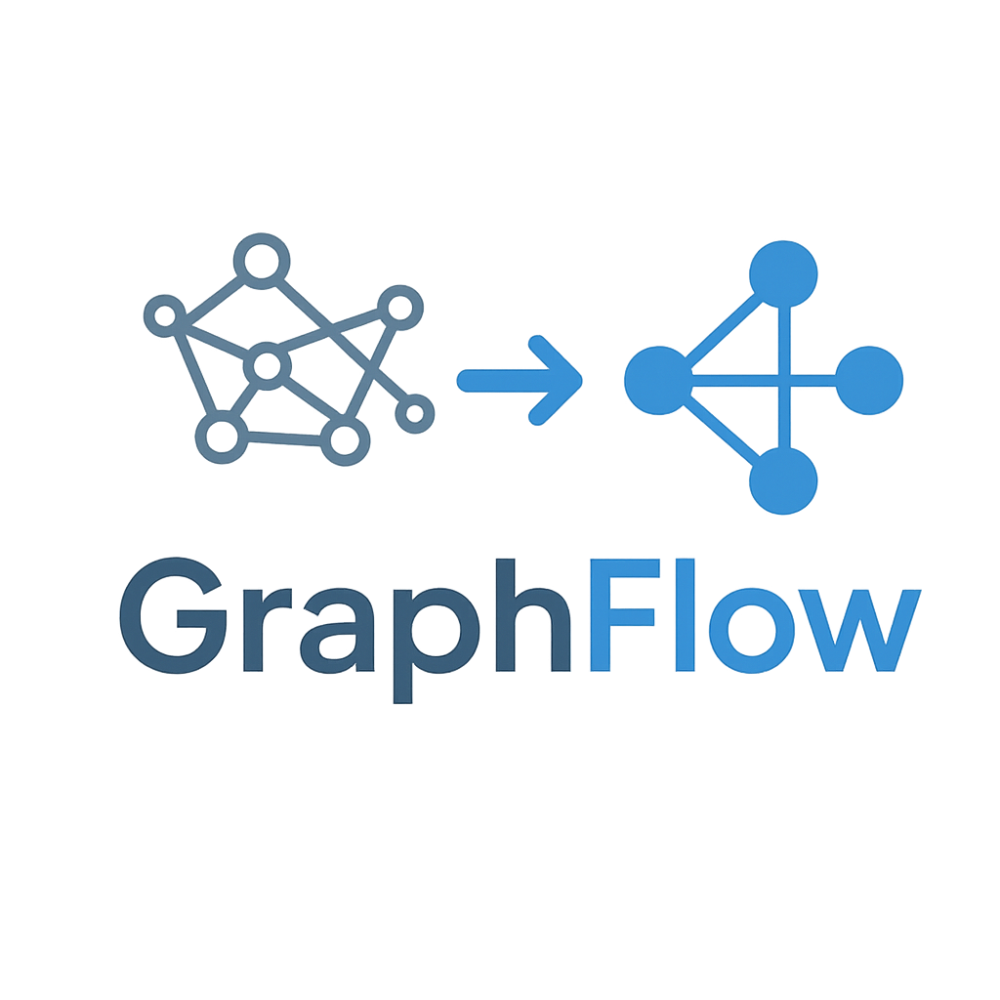

# Documento de Visión - Sistema GraphFlow

  
  

**UNIVERSIDAD PRIVADA DE TACNA**

**FACULTAD DE INGENIERÍA**

**Escuela Profesional de Ingeniería de Sistemas**

**Sistema GraphFlow - Organización y optimización de ideas mediante grafos estructurados**

**Curso:** *CALIDAD Y PRUEBAS DE SOFTWARE*

**Docente:** *PATRICK JOSÉ CUADROS QUIROGA*

**Integrantes:**

- ***Rosas Chambilla, Jefferson 2021072618***
- ***Vargas Candia, Hashira Belén 2022075480***
- ***CHALLO COAQUERA, Alexsander Wilson 2017057578***

**Tacna -- Perú**

***2025***

## CONTROL DE VERSIONES

| Versión | Hecha por | Revisada por | Aprobada por | Fecha     | Motivo           |
|---------|-----------|--------------|--------------|-----------|------------------|
| 1.0     | MPV       | ELV          | ARV          | 10/10/2020| Versión Original |

**Sistema GraphFlow - Organización y optimización de ideas mediante grafos estructurados**

**Documento de Visión**

**Versión 1.0**

**INDICE GENERAL**
**1. Introducción**
1.1 Propósito
1.2 Alcance
1.3 Definiciones, Siglas y Abreviaturas
1.4 Referencias
1.5 Visión General

**2. Posicionamiento**
2.1 Oportunidad de negocio
2.2 Definición del problema

**3. Descripción de los interesados y usuarios**
3.1 Resumen de los interesados

3.2 Resumen de los usuarios
3.3 Entorno de usuario
3.4 Perfiles de los interesados
3.5 Perfiles de los Usuarios
3.6 Necesidades de los interesados y usuarios

**4. Vista General del Producto**
4.1 Perspectiva del producto
4.2 Resumen de capacidades
4.3 Suposiciones y dependencias
4.4 Costos y precios
4.5 Licenciamiento e instalación

**5. Características del producto**

**6. Restricciones**

**7. Rangos de calidad**

**8. Precedencia y Prioridad**

**9. Otros requerimientos del producto**

a) Estándares legales

b) Estándares de comunicación

c) Estándares de cumplimiento de la plataforma

d) Estándares de calidad y seguridad

**CONCLUSIONES**

**RECOMENDACIONES**

**BIBLIOGRAFIA**

**WEBGRAFIA**

---

## 1. Introducción

¿Alguna vez has sentido que tienes todos los apuntes, pero no sabes por dónde empezar?

¿Te has perdido entre conceptos, fórmulas y ejercicios sin un orden claro?

¿Pasas horas estudiando, pero sientes que no avanzas?

GraphFlow nace para resolver exactamente eso.

Es una herramienta diseñada por y para estudiantes de Ingeniería de Sistemas que transforma tus apuntes desordenados en flujos visuales estructurados, como un mapa claro del conocimiento. Usa grafos para mostrarte qué concepto va antes, cuál después, y cómo se conectan todos.

**Con GraphFlow:**

- Organizas tu conocimiento en segundos.
- Visualizas relaciones lógicas entre temas.
- Estudias mejor, sin perderte en el caos.
- Generas mapas de estudio personalizados.
- Guardas y reusas tus grafos cuando quieras.

Ya sea que estés preparando un parcial de algoritmos, bases de datos o programación, GraphFlow te ayuda a ver el camino claro.

### 1.1 Propósito

El propósito de este documento es definir la visión, alcance, usuarios, funcionalidades y requisitos clave del sistema GraphFlow, una herramienta diseñada para transformar información académica no estructurada (como apuntes, ideas sueltas o ejercicios) en representaciones gráficas estructuradas basadas en grafos. Este sistema busca mejorar el proceso de estudio y comprensión de estudiantes de Ingeniería de Sistemas mediante la organización lógica y visual del conocimiento.

### 1.2 Alcance

GraphFlow será una aplicación web de propósito académico que permitirá a los estudiantes:

- Ingresar texto (apuntes, resúmenes, ejercicios).
- Procesar automáticamente la información para extraer conceptos clave.
- Generar un grafo interactivo que represente el orden lógico de aprendizaje.
- Editar y exportar el grafo resultante.

El sistema no almacenará datos en servidores externos (modo local o sesión) a no ser se inicie sesión, y está orientado exclusivamente al entorno universitario. No incluye funcionalidades de redes sociales, chat ni colaboración en tiempo real.

### 1.3 Definiciones, Siglas y Abreviaturas

| Concepto | Descripción |
|----------|-------------|
| GraphFlow | Sistema de organización y optimización de conocimiento mediante grafos. |
| Grafo | Estructura matemática compuesta por nodos (conceptos) y aristas (relaciones). |
| Nodo | Representación de un concepto, tema o paso en el proceso de aprendizaje. |
| Arista | Conexión entre nodos que indica dependencia, secuencia o relación lógica. |
| NLP (Procesamiento de Lenguaje Natural) | Técnica básica para extraer información de texto (en este caso, reglas simples o modelo ligero). |
| UI | Interfaz de usuario (User Interface). |
| PDF, TXT | Formatos de archivo soportados para entrada de datos. |

### 1.4 Referencias

- Pressman, R. S., & Maxim, B. R. (2020). Ingeniería de software: Una perspectiva pragmática. McGraw-Hill.
- Sommerville, I. (2019). Software Engineering. Pearson.
- IEEE. (1998). IEEE Recommended Practice for Software Requirements Specifications (IEEE Std 830-1998).
- W3C. (2023). Web Content Accessibility Guidelines (WCAG) 2.1. https://www.w3.org/TR/WCAG21/

### 1.5 Visión General

Este documento describe la visión completa del sistema GraphFlow, comenzando por el posicionamiento del problema, los usuarios objetivo, las capacidades del producto, y los requisitos funcionales y no funcionales. La estructura sigue las mejores prácticas de ingeniería de requisitos, facilitando su uso en etapas posteriores de diseño, pruebas y calidad del software.

## 2. Posicionamiento

### 2.1 Oportunidad de negocio

Existe una necesidad real entre estudiantes universitarios —especialmente en carreras técnicas como Ingeniería de Sistemas— de herramientas que ayuden a organizar grandes volúmenes de información dispersa. Aunque existen apps de toma de notas (OneNote, Notion), ninguna se enfoca en transformar automáticamente el conocimiento en flujos lógicos y visuales. GraphFlow aprovecha esta brecha con un enfoque simple, técnico y centrado en el aprendizaje eficiente.

### 2.2 Definición del problema

Los estudiantes acumulan apuntes en múltiples formatos (cuadernos, PDFs, notas digitales) sin un sistema claro para organizarlos. Esta fragmentación dificulta el estudio, la comprensión profunda y la resolución de problemas complejos. Además, muchos no saben por dónde empezar al repasar, lo que genera pérdida de tiempo y frustración.

GraphFlow resuelve este problema al convertir información en bruto en un flujo estructurado y visual, facilitando el aprendizaje secuencial y lógico.

## 3. Descripción de los interesados y usuarios

### 3.1 Resumen de los interesados

| INTERESADO | INTERÉS |
|------------|---------|
| Estudiantes de Ingeniería de Sistemas | Usuarios principales; necesitan organizar apuntes y mejorar estudio. |
| Profesores de asignaturas técnicas | Podrían usarlo como herramienta de apoyo pedagógico. |
| Universidad UPT (como institución) | Interesada en mejorar el rendimiento académico y uso de tecnología educativa. |
| Desarrollador (estudiante del curso) | Responsable del diseño, pruebas y calidad del software. |

### 3.2 Resumen de los usuarios

- **Usuarios Finales (Estudiantes):** Estudiantes de ingeniería de sistemas que buscan una herramienta para organizar sus ideas y mejorar la planificación de sus proyectos académicos.

### 3.3 Entorno de usuario

Los usuarios de GraphFlow son estudiantes que trabajan en un entorno académico, utilizando computadoras personales (laptops o desktops) con sistemas operativos comunes como Windows, macOS o Linux. El software estará disponible como una aplicación web o de escritorio simple.

### 3.4 Perfiles de los interesados

- **Estudiantes:** entre 18 y 25 años, manejo básico de herramientas digitales, alto nivel de estrés académico.
- **Profesores:** buscan mejorar métodos de enseñanza, receptivos a herramientas que faciliten el aprendizaje.
- **Desarrollador:** estudiante del curso de Calidad y Pruebas, con conocimientos en desarrollo web y pruebas de software.

### 3.5 Perfiles de los Usuarios

- **Usuario tipo:** Estudiante de 7mo ciclo de Ingeniería de Sistemas.
- **Habilidades técnicas:** Uso básico de computadoras, manejo de archivos, navegadores.
- **Expectativas:** Herramienta rápida, sin curva de aprendizaje alta, que no requiera instalación.
- **Frecuencia de uso:** Esporádica (antes de exámenes o al preparar proyectos).

### 3.6 Necesidades de los interesados y usuarios

| NECESIDAD | TIPO |
|-----------|------|
| Organizar apuntes desordenados en un flujo lógico | Funcional |
| Visualizar relaciones entre conceptos | Funcional |
| Generar mapas de estudio personalizados | Funcional |
| Exportar el resultado para revisar offline | Funcional |
| Que el sistema sea rápido y no consuma muchos recursos | No funcional |
| Que no requiere registro ni cuenta | No funcional |
| Interfaz simple e intuitiva | No funcional |

## 4. Vista General del Producto

### 4.1 Perspectiva del producto

GraphFlow es una aplicación monolítica ligera basada en web, que opera principalmente en el navegador. No requiere servidor backend persistente. El procesamiento se realiza en el cliente (frontend), usando JavaScript y librerías de grafos (como Cytoscape.js o D3.js). Se integra como una herramienta de apoyo académico, no como un sistema de gestión de aprendizaje (LMS).

### 4.2 Resumen de capacidades

- Carga de texto desde archivo (.txt, .pdf simple) o entrada manual.
- Extracción automática de conceptos clave.
- Generación de grafo con orden lógico (secuencia, dependencias).
- Edición interactiva del grafo (mover nodos, agregar conexiones).
- Exportación a PNG, PDF o Markdown.
- Almacenamiento local (localStorage) para recuperar sesiones.

### 4.3 Suposiciones y dependencias

- El usuario ingresa texto en español, con estructura mínima (párrafos, viñetas).
- No se procesan imágenes ni fórmulas matemáticas complejas (solo texto).
- Se asume que el usuario tiene conocimiento básico del tema (el sistema no enseña, solo organiza).
- Dependencias técnicas: HTML5, CSS3, JavaScript, biblioteca de grafos.

### 4.4 Costos y precios

- GraphFlow es un proyecto académico sin fines de lucro.
- Costo de desarrollo: Tiempo del estudiante (sin inversión económica).
- Distribución: Gratuita, código abierto (opcional).
- Infraestructura: Hosting estático gratuito (GitHub Pages, Netlify).

### 4.5 Licenciamiento e instalación

- Licencia: MIT (permite uso académico y modificación).
- Instalación: No requiere instalación. Acceso directo vía navegador.
- Compatibilidad: Windows, macOS, Linux. Chrome, Firefox, Edge.

## 5. Características del producto

- Entrada de datos (texto plano, PDF simple).
- Procesamiento de texto (extracción de conceptos).
- Generación de grafo (estructura dirigida).
- Interfaz visual interactiva.
- Edición manual del grafo.
- Exportación de resultados.
- Historial local de flujos generados.

## 6. Restricciones

- No procesa imágenes ni texto escaneado sin OCR.
- No soporta colaboración en tiempo real.
- No incluye autenticación de usuarios.
- Rendimiento limitado con documentos > 3000 palabras.
- Solo disponible en español (por ahora).

## 7. Rangos de calidad

- Usabilidad: 80% de usuarios deben poder generar un grafo en menos de 3 minutos (prueba de usabilidad).
- Precisión: Al menos el 75% de los flujos generados deben ser coherentes según evaluación de pares.
- Rendimiento: Tiempo de procesamiento < 10 segundos para 1000 palabras.
- Cobertura de pruebas: Mínimo 70% de cobertura de código en módulos críticos.

## 8. Precedencia y Prioridad

- Alta prioridad: Entrada de datos, generación de grafo, visualización.
- Media prioridad: Edición manual, exportación.
- Baja prioridad: Búsqueda en historial, sugerencias de mejora.

## 9. Otros requerimientos del producto

### a) Estándares legales

- Cumple con políticas de uso responsable de software académico.
- No almacena ni transmite datos personales (cumple con principios de privacidad básica).
- Sin violación de derechos de autor (el usuario es responsable del contenido ingresado).

### b) Estándares de comunicación

- Interfaz en español.
- Mensajes de error claros y descriptivos.
- Sin requerimientos de comunicación externa (no hay API externa).

### c) Estándares de cumplimiento de la plataforma

- Compatible con HTML5, CSS3, ES6.
- Responsive básico (funciona en pantallas ≥ 13").
- Accesibilidad mínima (contraste, navegación con teclado).

### d) Estándares de calidad y seguridad

- Validación de entrada (evitar inyección de scripts).
- Datos almacenados solo en localStorage (sin envío a servidores).
- Basado en ISO/IEC 25010:2011 (calidad de software):
  - Funcionalidad, usabilidad, eficiencia, mantenibilidad.

## CONCLUSIONES

GraphFlow aborda una necesidad real en el entorno académico universitario: la organización eficiente del conocimiento técnico. Al transformar apuntes desordenados en flujos estructurados mediante grafos, mejora la comprensión, el estudio y la resolución de problemas. Su enfoque simple, técnico y centrado en el usuario lo convierte en una herramienta valiosa para estudiantes de Ingeniería de Sistemas.

## RECOMENDACIONES

- Validar el sistema con estudiantes reales mediante pruebas de usabilidad.
- Aplicar pruebas de caja negra y unitarias a módulos críticos.
- Documentar métricas de calidad (cobertura, defectos, tiempo de respuesta).
- Considerar futuras mejoras con IA básica (como clasificación de dificultad).

## BIBLIOGRAFIA

- Pressman, R. S., & Maxim, B. R. (2020). Ingeniería de software: Una perspectiva pragmática. McGraw-Hill.
- Sommerville, I. (2019). Software Engineering. Pearson.
- IEEE Std 830-1998. IEEE Recommended Practice for Software Requirements Specifications.

## WEBGRAFIA

- https://www.w3.org/TR/WCAG21/
- https://cytoscape.org/
- https://d3js.org/
- https://github.com
